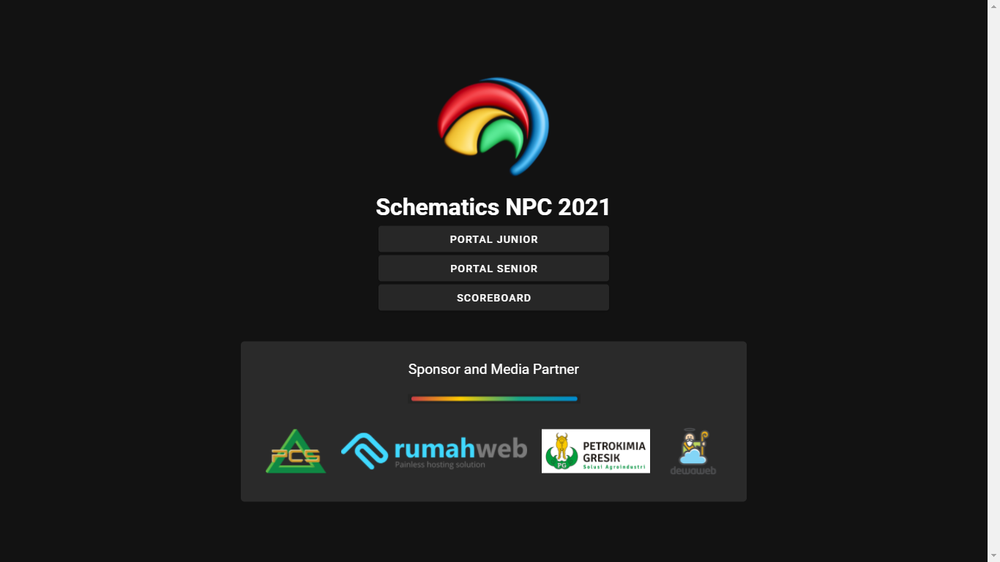
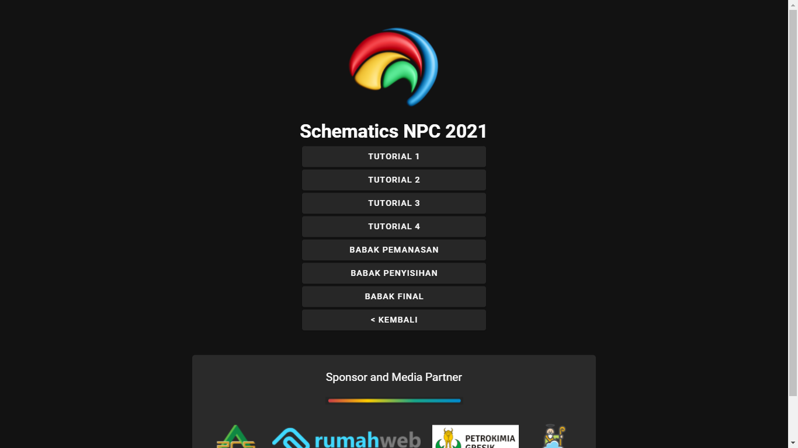
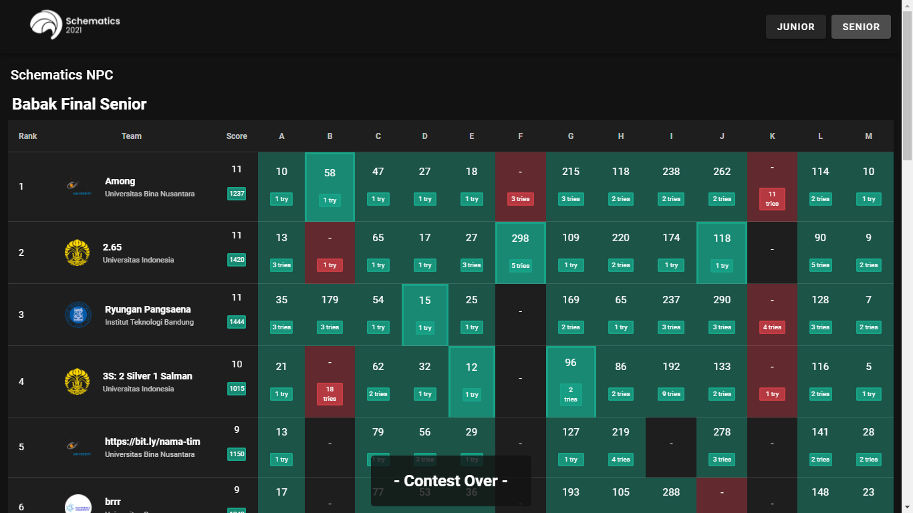
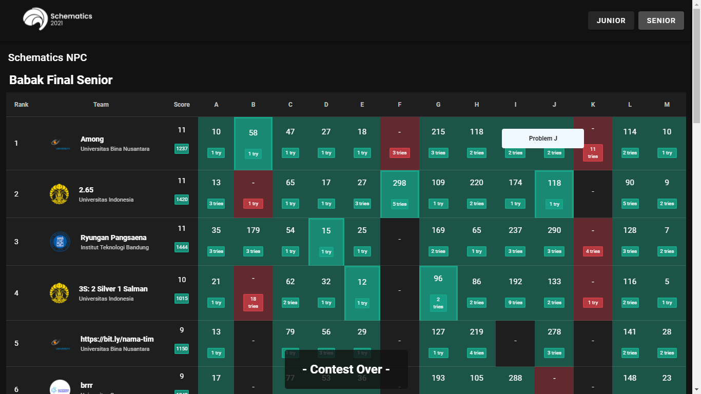
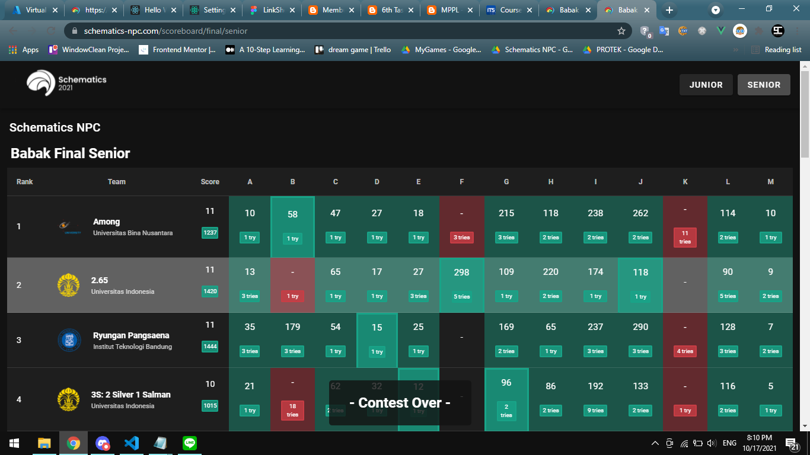

# schematics-npc-2021-archive

Adalah archive mengenai pengerjaan schematics npc oc 2021

Domjudge Versi 7.3

## Live Website

Live: http://schematics-npc.com/ (kalau masih ada)

Live Backup: https://sch-npc-scoreboard-vercel.vercel.app/

Scoreboard Public (Vue.js) (sorry code nya berantakan wkwk, masih belajar juga sebenarnya): https://github.com/Syafiqjos/sch-npc-scoreboard

## Repository Source

Domjudge Judgehost Bundle: https://github.com/zydhanlinnar11/sch-npc-senior-judgehost

Domjudge Documentation: https://www.domjudge.org/docs/manual/7.3

Backend support: https://github.com/iwandepe/sch-npc-senior-online-judge

## Installation (perlu docker)

Install Domjudge Domserver (user: admin, pass: [dapet dari hasil eksekusi bash]): [Read Me](./InstallDomjudgeServer.md)

Install Domjudge Judgehost: [Read Me](./InstallDomjudgeJudgehost.md)

## Experimental

SSO (agak lupa, harusnya perlu edit file default dari domserver di bagian login): [Read Me](./SSO)

Solution Default untuk setiap bahasa pemrograman: [Read Me](./SolutionTest)

Config Domjudge fix untuk setiap bahasa: [Config Domjudge](./ConfigDomjudge)

## Preview

